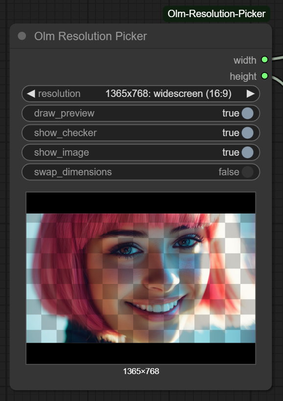

# Olm Resolution Picker for ComfyUI



- **Author:** Olli Sorjonen
- **GitHub:** [https://github.com/o-l-l-i](https://github.com/o-l-l-i)
- **X:** [https://x.com/Olmirad](https://x.com/Olmirad)
- **Version:** 1.0.1 (Restructuring code, new features)
- **NOTE:** New added fields will break the node in graphs, so use caution!

The **Olm Resolution Picker** is a lightweight, customizable resolution selector node for ComfyUI.
It allows you to define your preferred image resolutions using a simple `resolutions.txt` file — making it future-proof, editable, and great for organized workflows.

This node is built for users who want more than just a few hardcoded presets, or who don't want to have a huge node pack just to get a resolution selector. Whether you're targeting SDXL aspect ratios, cinematic dimensions, or mobile previews, this node makes resolution management intuitive and scalable.

---

## ✨ Features

- Outputs resolution as `width` and `height` integers
  - **User-editable `resolutions.txt`** for full control
  - Supports **labels** (e.g., `768x1344: vertical (9:16)`)
  - Allows **group headers** using `-- Header:` syntax
  - Skips invalid lines or malformed input automatically
  - Built-in fallback resolution to prevent broken graph evaluation
- Responsive, scaling UI
- Aspect Ratio Visualization:
  - Optionally toggle a preview image to better understand image composition and framing at a given resolution
- Checkerboard Overlay:
  - Helps visually estimate scale — tile size remains constant regardless of resolution, giving a quick sense of dimensions
- Replaceable Preview Image:
  - Swap test_image.png in the node’s "js" directory to use your own visual reference
- Preview image can be disabled completely if needed
- Swap dimension feature
  - swap width with height for easy portrait to landscape
- Custon resolution mode allows numeric input of resolution
- Custom resolution snap feature
  - Snap to divisible by 1,2,4,8,16,32,64

---

## Installation

Clone this repository to your ComfyUI/custom_nodes folder.

2. Check/install dependencies.

### Most likely you don't need to do this:
You should already have all of the dependencies installed if you have ComfyUI up and running. Remember to always active the virtual environment (venv) before installing anything.

```
pip install -r requirements.txt
```

Your folder structure should look like:

```
ComfyUI/
└── custom_nodes/
└──── ComfyUI-Olm-Resolution-Picker/
├────── init.py
├────── olm_resolution_picker.py
└────── resolutions.txt
```

Restart ComfyUI after installation.

---

## Usage

1. Add the **Olm Resolution Picker** node in your ComfyUI graph.
2. Pick a resolution from the dropdown, toggle visualizations on/off.
3. Define resolutions in the `resolutions.txt` file (see example below).
4. The selected resolution is returned as `width` and `height` (INT, INT).
5. Safe fallback to `1024x1024` if the selection is invalid or a header is selected.

---

## How the resolutions.txt Configuration Works

Have a `resolutions.txt` file in the same folder as the node.
I have provided an example/default file.
The format is following:

```
// First comment
-- SDXL
1024x1024: square (1:1)
768x1344: vertical (9:16)

// Second comment
-- Cinematic
1536x640: landscape (12:5)
1564x670: cinematic (21:9)
```

- Each entry becomes selectable in a dropdown.
- The node parses only valid `WxH` resolutions and ignores malformed entries.
- A resolution entry is defined by `[width number][x][height number]`.
- Labels after `:` are shown in the UI but ignored for output.
- Use `--` to add a header.
- Use `//` for comments, these are not shown anywhere.

## Customizing the Test Image

The preview panel includes a small test image to help visualize the selected aspect ratio and cropping.

If you'd like to use your own image:

- Locate the `test_image.png` file inside the `js/` folder of this node's directory.
- Replace it with any image of your choice (a `.png` file as it's hard-coded).
- The preview area assumes a 4:3 aspect ratio (e.g., 1024x768), so images that match this ratio will display best without blank areas.

---

## Parameters

| Name            | Type          | Description                      |
|-----------------|---------------|----------------------------------|
| `resolution`    | Choice        | Resolution string from dropdown  |
| `show_checker`  | Bool          | Optional frontend toggle         |
| `show_image`    | Bool          | Optional frontend toggle         |
| `Output`        | `(INT, INT)`  | Width and height integers        |

---

## Notes

This is a personal learning project (v1), created to explore custom node development in ComfyUI. While I took care to ensure it functions properly and it has functioned fine in my own use, there may still be bugs, rough edges, or unexpected behavior - so use with caution.

Feedback is welcome! Feel free to open an issue if you encounter a problem or have suggestions or ideas to improve the node.

---

## Updates 1.0.1

- Refactored to more modular code structure for new features (coming later) and maintainability
- Added feature for disabling preview rendering
- Added swap dimensions features (as requested)
- Added custom resolution feature
  - You can basically use this to set resolution
- Added custom resolution snapping feature
  - Snap to divisible by 1,2,4,8,16,32,64
- Improved scaling responsive preview image rendering
- Improved node space usage
- Improved node widget handling

---

## License & Usage Terms

Copyright (c) 2025 Olli Sorjonen

This project is source-available, but not open-source under a standard open-source license, and not freeware.
You may use and experiment with it freely, and any results you create with it are yours to use however you like.

However:

Redistribution, resale, rebranding, or claiming authorship of this code or extension is strictly prohibited without explicit written permission.

Use at your own risk. No warranties or guarantees are provided.

The only official repository for this project is: 👉 https://github.com/o-l-l-i/ComfyUI-Olm-Resolution-Picker

---

## Author

Created by [@o-l-l-i](https://github.com/o-l-l-i)